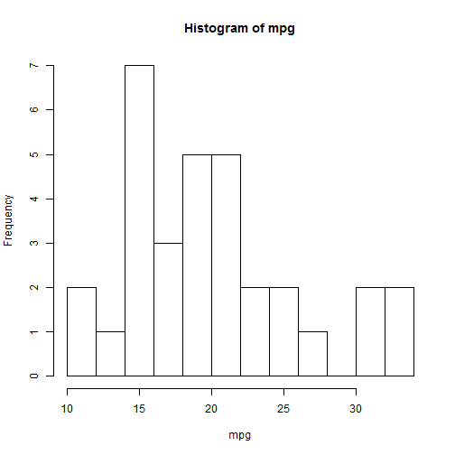

## Introduction

- app addresses  determinants of  miles per callon (MPG) of passenger cars 
- mtcars dataset contains 32 observations on 11 variables
- app allows user to compare two different linear model specifications with different regressors
- user can fine tune displayed information

--- .class #id 


## Output info of the app

- default summary for the dataset

- histogram for chosen variable

- default summary tables for each model

- model diagnostics  to identify influential observations.

- plots to identify outliers and influential observations 

- ANOVA table comparing the two models if embedded 

- The complete app can be found at: https://lfranckx.shinyapps.io/course_shiny_project/

--- .class #id 


### Illustration:  histogram and model output


```r
var_his <- "mpg"; break_ch <- 10
hist(mtcars[, var_his] , xlab =  var_his, main = paste("Histogram of", var_his), breaks = break_ch)
```

 

 
--- .class #id 


--- .class #id 


```r
regressors <- c("wt" = "wt", "qsec" = "qsec",  "gear"= "gear", "carb"= "carb")
dataforlm <- mtcars[, c("mpg",regressors)]
fit_gear <- lm(mpg  ~ ., data =  dataforlm )
fit_gear
```

```
## 
## Call:
## lm(formula = mpg ~ ., data = dataforlm)
## 
## Coefficients:
## (Intercept)           wt         qsec         gear         carb  
##     13.5291      -3.7019       0.7613       1.9228      -0.7848
```

